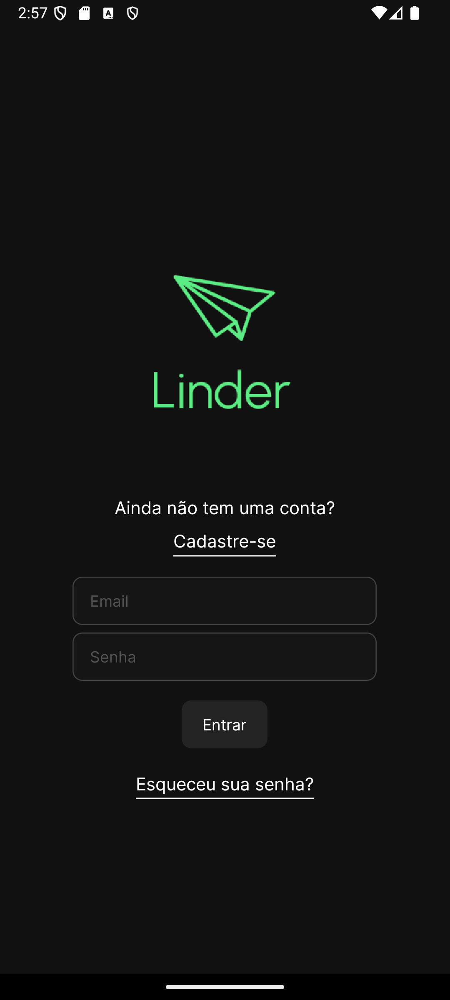
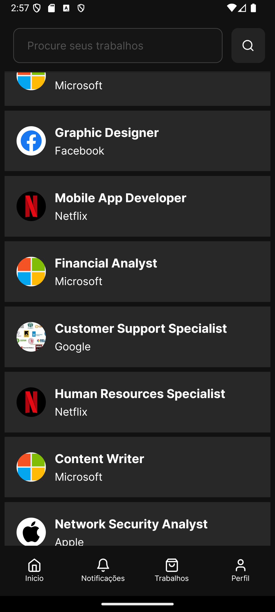

# Linder

Projeto de programação para dispositivos móveis - IFSP 2024. Tema: Rede social profissional, utilizados por profissionais e empressas

## Descrição

Frontend do projeto. Aplicativo Mobile, criado utilizando react-native.

## Como usar

### Dependencies

* Requer [React/Node.js](https://nodejs.org/).
* [Linder-Backend](https://github.com/JvSecate/LINDER-Backend).
* Requer [Expo GO](https://expo.dev/go) para executar o aplicativo (Android/IOS/Emulador).

### Instalação

* Em "_./src/_" Execute o seguinte comando:
```
yarn install
```
* Em seguida, execute comando:
```
yarn start
```
* Abra o aplicativo utilizando o Expo Go.

## Imagens



